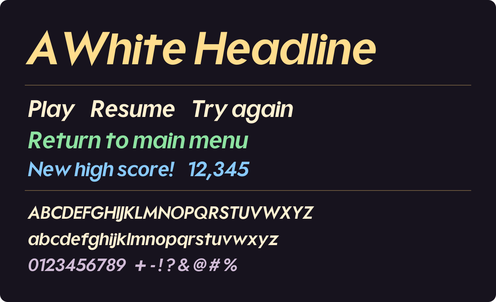

# AWhite Headline

An extra-bold italic sans-serif font. This repository packages the locally named AWhite Headline derivative of Plus Jakarta Sans. Available as TTF and WOFF2.



## Download

- **[AWhite-Headline.ttf](fonts/ttf/AWhite-Headline.ttf)** — installable desktop and app font.
- **[AWhite-Headline.woff2](fonts/woff2/AWhite-Headline.woff2)** — compressed webfont.
- **[Latest release](https://github.com/andrew-dougie/awhite-headline/releases/latest)** — complete package with license, examples, and tools.

On macOS, open the desktop font in Font Book and select **Install**. On Windows, right-click it and select **Install**. The family appears as **AWhite Headline** in font pickers.

## Font details

| Detail | Value |
| --- | --- |
| Family | AWhite Headline |
| Style | Italic |
| PostScript name | `AWhiteHeadline-Italic` |
| Weight | 800 |
| Mapped characters | 721 |
| Formats | TTF, WOFF2 |

Includes Latin letters, numerals, punctuation, and additional symbols. See the full [character map](fonts/characters.json). Unsupported characters require a fallback font. Uppercase and lowercase retain the forms in the supplied font.

The desktop file is preserved byte-for-byte from the font used in Best Friends. The WOFF2 is generated from that file and retains its glyph outlines, spacing, names, and character map. Vector outlines are included; color and pixelation are supplied by the host application.

## Web usage

```css
@font-face {
  font-family: "AWhite Headline";
  src: url("AWhite-Headline.woff2") format("woff2");
  font-weight: 800;
  font-style: italic;
  font-display: swap;
}

.sample {
  font-family: "AWhite Headline", sans-serif;
  font-weight: 800;
  font-style: italic;
  font-size: 2rem;
  line-height: 1.4;
}
```

An editable [browser specimen](examples/index.html) is included. Open it locally after downloading, or run `python3 -m http.server` from the repository and open `/examples/`.

## iOS usage

Add `AWhite-Headline.ttf` to the target’s resources and list it under `UIAppFonts` in Info.plist:

```swift
label.font = UIFont(name: "AWhiteHeadline-Italic", size: 28)
label.text = "Return to main menu"
```

## Packaging and verification

```sh
python3 -m venv .venv
source .venv/bin/activate
pip install -r requirements.txt
python tools/package-font.py
python tools/render-specimen.py
python tools/verify-font.py
```

The included desktop font supplies the outlines. The tools export WOFF2, generate the README specimen, and verify both formats. An editable font-design project or outline generator is not included.

## Attribution and license

Copyright 2020 The Plus Jakarta Sans Project Authors. The embedded metadata credits Gumpita Rahayu and Tokotype. [Upstream project](https://github.com/tokotype/PlusJakartaSans). Licensed under the **[SIL Open Font License 1.1](OFL.txt)**. Retain the included copyright and license when redistributing the font. No Reserved Font Names are declared in the included license.
